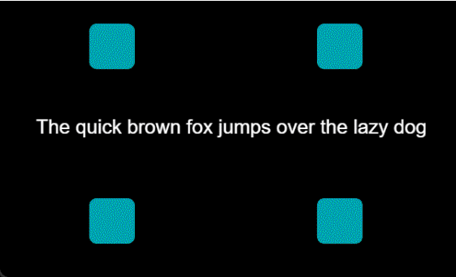

<h1 align="center">Vue 3 Pixi Transition</h1>

<p align="center">
  <strong>Vue Transition for PixiJS based on <a href="https://github.com/hairyf/vue3-pixi">vue3-pixi</a> </strong>
</p>

<br />

<p align="center">
  <!--  -->
  <!--  -->
  
  
  
</p>

<br>
<p align="center">
  
</p>

## Try it Online

[](https://stackblitz.com/edit/vue-pixi-transition)

## Install

> from vue3-pixi@0.6.3 Built in at the beginning, you only need to install vue3 pixi to use vue pixi transition

## Usage

`vue3-pixi` is used to control the transition effects of Pixi objects, similar to the [Vue Transition](https://cn.vuejs.org/guide/built-ins/transition.html#javascript-hooks) component (except for CSS mode).

```html
<script setup lang="ts">
import { PTransition } from "vue3-pixi";
import { Container } from 'pixi.js'
function onBeforeEnter(el: Container) {}
function onEnter(el: Container, done: Function) {}
function onLeave(el: Container, done: Function) {}
// ....
const show = ref(true)
</script>

<template>
  <PTransition
    @before-enter="onBeforeEnter"
    @enter="onEnter"
    @after-enter="onAfterEnter"
    @leave="onLeave"
  >
    <container v-if="show"><!-- pixi-element --><container>
  </PTransition>
</template>
```

> Note that `after-leave` and `leave-cancelled` are invalid due to the lack of CSS mode.

## difference

Unlike the Vue Transition, you can achieve transition effects by setting different properties:

```html
<script setup lang="ts">
import { PTransition } from "vue3-pixi";
</script>

<template>
  <PTransition
    :duration="{ enter: 1000, leave: 700 }"
    :before-enter="{ alpha: 0, scaleX: 0.25, scaleY: 0.25 }"
    :enter="{ alpha: 1, scaleX: 1, scaleY: 1 }"
    :before-leave="{/* ... */}"
    :leave="[
      { scaleX: 0.25, scaleY: 0.25 },
      { delay: 500, duration: 500, alpha: 0 },
    ]"
  >
    <!-- ... -->
  </PTransition>
</template>
```

> The `delay` and `duration` are used to individually control the delay and duration of each animation node (the `item-duration` uses the `duration` property by default).

## Ease Presets

By default, all transition effects are linear. You can customize the transition easing by using custom cubic-bezier curves.

```html
<script setup lang="ts">
import { PTransition, EasePresets } from "vue3-pixi";
</script>

<template>
  <PTransition
    :before-enter="{ x: -50 }"
    :enter="{ ease: [.42, 0, 1, 1], x: 0 }"
    :level="[
      { ease: EasePresets.easeInQuart, x: -50 },
      { delay: 500, alpha: 0 },
    ]"
  >
    <!-- ... -->
  </PTransition>
</template>
```

The following transitions are available via the `TransitionPresets` constant.

- [`linear`](https://cubic-bezier.com/#0,0,1,1)
- [`easeInSine`](https://cubic-bezier.com/#.12,0,.39,0)
- [`easeOutSine`](https://cubic-bezier.com/#.61,1,.88,1)
- [`easeInOutSine`](https://cubic-bezier.com/#.37,0,.63,1)
- [`easeInQuad`](https://cubic-bezier.com/#.11,0,.5,0)
- [`easeOutQuad`](https://cubic-bezier.com/#.5,1,.89,1)
- [`easeInOutQuad`](https://cubic-bezier.com/#.45,0,.55,1)
- [`easeInCubic`](https://cubic-bezier.com/#.32,0,.67,0)
- [`easeOutCubic`](https://cubic-bezier.com/#.33,1,.68,1)
- [`easeInOutCubic`](https://cubic-bezier.com/#.65,0,.35,1)
- [`easeInQuart`](https://cubic-bezier.com/#.5,0,.75,0)
- [`easeOutQuart`](https://cubic-bezier.com/#.25,1,.5,1)
- [`easeInOutQuart`](https://cubic-bezier.com/#.76,0,.24,1)
- [`easeInQuint`](https://cubic-bezier.com/#.64,0,.78,0)
- [`easeOutQuint`](https://cubic-bezier.com/#.22,1,.36,1)
- [`easeInOutQuint`](https://cubic-bezier.com/#.83,0,.17,1)
- [`easeInExpo`](https://cubic-bezier.com/#.7,0,.84,0)
- [`easeOutExpo`](https://cubic-bezier.com/#.16,1,.3,1)
- [`easeInOutExpo`](https://cubic-bezier.com/#.87,0,.13,1)
- [`easeInCirc`](https://cubic-bezier.com/#.55,0,1,.45)
- [`easeOutCirc`](https://cubic-bezier.com/#0,.55,.45,1)
- [`easeInOutCirc`](https://cubic-bezier.com/#.85,0,.15,1)
- [`easeInBack`](https://cubic-bezier.com/#.36,0,.66,-.56)
- [`easeOutBack`](https://cubic-bezier.com/#.34,1.56,.64,1)
- [`easeInOutBack`](https://cubic-bezier.com/#.68,-.6,.32,1.6)

For more complex transitions, a custom function can be provided.

```html
<script setup lang="ts">
import { PTransition } from "vue3-pixi";
function easeOutElastic(n: number) {
  return  n === 0
    ? 0 : n === 1
      ? 1
      : (2 ** (-10 * n)) * Math.sin((n * 10 - 0.75) * ((2 * Math.PI) / 3)) + 1
}
</script>

<template>
  <PTransition
    :before-enter="{ alpha: 0, x: -50 }"
    :enter="{ alpha: 1, x: 0 }"
    :level="[
      { ease: easeOutElastic, x: 50 },
      { delay: 500, alpha: 0 },
    ]"
  >
    <!-- ... -->
  </PTransition>
</template>
```
## Custom Transition

You can also control the transition effects by setting `enter` and `level` to functions:

```html
<script setup lang="ts">
import { Transition } from "vue3-pixi";
import { Text } from 'pixi.js'
function typewriter(el: Text) {
  const speed = 1
  const text = el.text;
  const duration = text.length / (speed * 0.01);
  function tick(t: number) {
    const i = ~~(text.length * t);
    el.text = text.slice(0, i);
  }
   return {
     duration,
     tick
   };
}
</script>

<template>
  <PTransition :enter="typewriter" :level="typewriter">
    <Text>...</Text>
  </PTransition>
</template>
```

## Filters

You can also control the transition effects of filters by setting `before-enter`, `enter`, `before-leave`, `leave`, `...` to options or function:

```html
<script setup lang="ts">
import { PTransition } from "vue3-pixi";
// ....
const show = ref(true)
</script>
<template>
  <PTransition
    :duration="{ enter: 1000, leave: 700 }"
    :before-enter="{ alpha: 0 }"
    :enter="{ alpha: 1 }"
    :leave="{ alpha: 0 }"
  >
    <sprite v-if="show" texture="...">
      <blur-filter
        :before-enter="{ strength: 10, blur: 80 }"
        :enter="{ strength: 0, blur: 0 }"
        :leave="{ blur: 80 }"
        :strength="0"
      />
    </sprite>
  </PTransition>
```

## Transition Group

`vue3-pixi` also supports the transition effects of Pixi objects in the `v-for` loop:

```html

<script setup lang="ts">
import { PTransitionGroup } from "vue3-pixi";
import { Container, Sprite } from 'pixi.js'

const items = ref([
  { texture: '...' },
  { texture: '...' },
  { texture: '...' },
])
// ....
const show = ref(true)
</script>
<template>
  <PTransitionGroup
    :duration="{ enter: 1000, leave: 700 }"
    :before-enter="{ alpha: 0 }"
    :enter="{ alpha: 1 }"
    :leave="{ alpha: 0 }"
  >
    <sprite v-for="(item, index) in items" :key="index" texture="..." />
  </PTransitionGroup>
</template>
```

## License

[MIT](./LICENSE) License © 2022-PRESENT [hairyf](https://github.com/hairyf)
